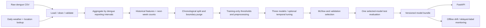

# Dengue-Risk-MLOps1

A Python 3.11 undergraduate Computer Science project that classifies **next-week
dengue outbreak risk** for Sri Lankan reporting districts as **LOW, MEDIUM, HIGH**,
using historical weekly cases and observed weather. Models run on a CPU.

**This system is an academic risk classification system and not a medical
diagnostic system.** Risk labels are relative to training-period case quantiles;
they are not official public-health outbreak definitions or population-adjusted
incidence thresholds. Probabilities have not been clinically validated or calibrated.

## Problem and Sri Lankan context

Historical case patterns and weather can support academic study of local dengue
risk. The practical question is: after reporting week **t** ends, what risk class
is expected for **t+1**? The supplied case file has 26 reporting areas, including
Kalmunai separately from Ampara. Sri Lanka has 25 administrative districts; the
extra reporting area must not be merged by assumption.

## Objectives

- Preserve and validate real raw observations, with transparent schema/coverage errors.
- Engineer historical features without future observations or random temporal splits.
- Compare Logistic Regression, Random Forest, and XGBoost on identical periods.
- Track experiments, persist complete preprocessing/model contracts, and serve a typed API.
- Demonstrate testing, CI, containers, DVC preparation, and drift/performance monitoring.

## Architecture



## Dataset information and placement

Place real CSVs here; raw files are never overwritten:

```text
data/raw/dengue/sri_lanka_dengue_weekly.csv
data/raw/weather/weatherData.csv
data/raw/weather/locationData.csv
```

The supplied dengue data have 25,766 rows, with reporting starts from 2006-12-23
through 2025-12-13. Required normalized fields: `year`, `week`, `start_date`,
`end_date`, `district`, `cases`. Dots/spaces/punctuation in headers are normalized.
The weather data have 142,371 daily observations from 2010-01-01 through 2024-06-08.
Their `location_id` joins the 27-row lookup's `city_name`.

Actual measurements include mean/min/max temperature, precipitation sum, and
**daily maximum** wind speed. The weekly wind statistic is honestly named
`mean_daily_max_wind_speed`; it is not a daily mean wind measurement. Humidity is
absent, so no humidity observations or features are invented. Configure different
real schemas in `configs/data.yaml`, including normalized weather column names
and aggregations. Missing critical columns, invalid dates/numbers, conflicting
duplicates, negative cases, and low merge coverage stop execution.

**Reporting calendar:** dengue weeks mostly run Saturday–Friday. Daily weather is
assigned to each district's actual `start_date`/`end_date` interval, then grouped
using the source `year`/`week` labels. Joining ISO weather weeks directly would
misalign the files. ISO week is used only as a seasonal feature. Two 2009 reporting
transitions have 6/8-day start gaps; affected targets/lags are invalidated.

The initial merge retains all dengue rows. It matches 73.26% to some weather;
18,825 rows have seven complete observed days. Kalmunai has no weather location.
Welimada/Bandarawela are retained in cleaning reports but are not guessed to
represent districts. Incomplete-week numeric aggregates become missing; partial
rainfall sums are not reported as full totals. No backward or forward filling is
performed. Training imputers are fitted only on their training fold/period.

By default training excludes incomplete-weather forecast rows **after** building
historical features and next-week targets on the entire dengue timeline. Coverage
exclusions are logged and saved in metadata. Thus evaluation covers 25 districts
during the weather overlap, not all dengue years. Set
`training.require_complete_weather: false` only for an explicitly justified
missing-weather experiment; use its own future-period evaluation.

The supplied files have no verified original provider URLs or licensing metadata.
Complete the provenance checklist in [data/raw/README.md](data/raw/README.md) before
redistribution or operational claims. No automatic download fabricates records.
`scripts/download_data.py --url HTTPS_URL --output data/raw/.../file.csv` accepts
an explicit verified source and refuses overwriting any existing CSV.

## Repository structure

```text
configs/                 Data, model, monitoring YAML
data/raw/{dengue,weather} Real immutable inputs (DVC candidates)
data/{interim,processed}  Generated cleaned and merged tables
notebooks/               Four reproducible, initially unexecuted analyses
src/data/                Loading, cleaning, validation, interval merging, splits
src/features/            Historical features and frozen-quantile target labels
src/models/              Training, evaluation, temporal tuning, prediction
src/utils/               Logging, configuration, JSON persistence, errors
pipelines/               Data, training, inference workflows
api/                     FastAPI endpoints, Pydantic contracts, model lifecycle
models/                  Generated bundle, thresholds, schema, metadata, reference
monitoring/              Drift reporting and delayed-label performance
tests/                   Fast synthetic unit fixtures and leakage checks
reports/{figures,metrics} Calculated reports and confusion matrices
scripts/                 argparse entrypoints
mlflow/                  Local SQLite tracking database
.github/workflows/       Lint/tests and test-before-Docker-build
deployment/              Docker notes and optional Kubernetes manifests
dvc.yaml                 Optional dependency-tracked preparation/training stages
```

## Installation and virtual environment

From the repository root, install **Python 3.11**:

```powershell
py -3.11 -m venv .venv
.venv\Scripts\Activate.ps1
python -m pip install --upgrade pip
python -m pip install -r requirements.txt
```

Linux/macOS: `python3.11 -m venv .venv`, then `source .venv/bin/activate` and the
same pip commands. Copy `.env.example` to `.env` if overrides are needed. Relative
data/config paths resolve against the repository root, not a particular machine.
The requirements pin the tested direct dependency versions. Use a fresh environment
for release reproduction and retain its full resolved package versions (including
transitive dependencies); every trained bundle records core dependency versions and a processed
data SHA-256. Numerical seeds are fixed, but cross-version bitwise identity is
not guaranteed. No TensorFlow/PyTorch dependency is used.

## Data pipeline and training

```bash
# Prepare and inspect only; generates reports/metrics/data_quality.json
python scripts/run_pipeline.py --data-only

# Complete preparation + training
python scripts/run_pipeline.py

# Reuse existing processed weekly.csv
python scripts/train_model.py

# Alternate configurations
python scripts/train_model.py --data-config configs/data.yaml --model-config configs/model.yaml
```

The forecast origin is the end of reporting week t. Current cases/weather at t
and district-specific case/weather lags are allowed. Rolling means include t
and previous weeks; growth relative to a zero previous count is missing. No t+1
case count, future weather, target field, date identifier, or merge indicator
enters preprocessing. `calendar_year`, month, quarter, and ISO `week_of_year`
provide calendar features while original reporting keys remain audit metadata.

The target is cases in the genuinely adjacent next week. Unobserved final targets
and calendar gaps are excluded, never filled. Train/validation/test use entire
chronological forecast weeks (70/15/15 by default), so districts in a week stay
together. Training labels crossing the validation forecast boundary and validation
labels crossing the test boundary are purged. Configurable explicit ISO
`validation_start`/`test_start` boundaries override ratios; configure both together.
All forecast/target date ranges and purge counts are logged.

Training's **next-week counts only** fit the 50th and 80th percentile thresholds:
LOW <= lower threshold; MEDIUM above lower and <= upper; HIGH above upper.
Thresholds stay frozen across validation/test and delayed-label scoring. Inference
uses the classes learned from that definition; it never recalculates quantiles.
Collapsed thresholds or a training period lacking any class fail clearly.

Numerical median imputation and categorical imputation/one-hot encoding live inside
each sklearn Pipeline. Only Logistic Regression is scaled. Logistic Regression
and Random Forest use balanced class weights; XGBoost uses balanced training
sample weights. No oversampling occurs. The **validation macro F1** selects the
model by default; only the selected model is evaluated once on the test set per
training run. Keep the held-out test period fixed and do not iterate model choices
using its reported performance. The final model remains fitted on training only
to preserve the documented threshold/preprocessing contract.

Optional tuning: set `tuning.enabled: true` in `configs/model.yaml`. Small
RandomizedSearchCV searches run within training with calendar-grouped expanding
folds, purged boundary labels, fold-specific thresholds, and fold-fitted pipelines.
This costs more CPU; it is disabled by default.

Generated `models/` outputs are `best_model.joblib` (a coherent bundle of pipeline,
schema, thresholds, and metadata), `target_thresholds.json`, `feature_schema.json`,
`model_metadata.json`, and `reference_data.csv`. Archive the whole generation
before replacing a deployed version. joblib loads trusted local artifacts only.
Reports contain calculated accuracy, macro precision/recall/F1, weighted F1,
per-class metrics, HIGH recall, confusion matrices, and multiclass one-vs-rest AUC
where defined. No metric is hardcoded.

## MLflow

Each model has a separate run in `dengue-risk-classification`, including parameters,
training/validation periods, validation metrics, schema, thresholds, classification
report, confusion matrix, and the complete model. The selected run is tagged
`selected_best` and receives its final test metrics. A local saved best bundle
is always produced; a remote registry is not required.

Default tracking uses `mlflow/mlflow.db` (SQLite); MLflow artifacts are local.
To view it from the repository root:

```bash
mlflow ui --backend-store-uri sqlite:///mlflow/mlflow.db --port 5000
```

Open http://127.0.0.1:5000. An explicitly configured `MLFLOW_TRACKING_URI` overrides
the local default. A configured remote server must be reachable; tracking failures
are reported rather than silently discarding experiments. For an optional local
server, `docker compose --profile tracking up --build`; set the local shell's
`MLFLOW_TRACKING_URI=http://127.0.0.1:5000` before training against it. No external
server or storage is contacted by default training.

## FastAPI and Swagger

```bash
uvicorn api.main:app --host 127.0.0.1 --port 8000
```

Open http://127.0.0.1:8000/docs for Swagger. Endpoints:

| Endpoint | Purpose |
|---|---|
| GET / | Project information and academic disclaimer |
| GET /health | status, model_loaded, model_version; HTTP 503 if not ready |
| GET /model-info | Public metadata, exact numeric input schema, frozen thresholds |
| POST /predict | district, prediction, LOW/MEDIUM/HIGH probabilities, model_version |

`POST /predict` accepts `{"district": "...", "features": {...}}`, where every
engineered numeric key from `/model-info` is present. Historical lags may be null
where the schema permits; current cases/calendar must be valid, and the default
complete-weather model requires observed weather fields. Use the generated
`reports/prediction_example.json`, drawn from a real held-out observation:

```bash
curl -X POST http://127.0.0.1:8000/predict -H "Content-Type: application/json" --data-binary @reports/prediction_example.json
```

In PowerShell use `curl.exe`. Invalid/missing/extra/nonfinite features return 422;
unavailable artifacts return 503. Internal errors are logged privately and receive
a generic 500 response. The API consumes engineered observations, not raw daily
history: construct them using `build_features` on an ordered real history first.
Callers are responsible for ensuring their observation week and publication
latencies match the documented end-of-week forecast origin. Unknown district
categories are encoded safely, but predictions outside the trained district list
are extrapolations and not covered by reported test performance.

## Docker and optional Kubernetes

Train locally first; artifacts are mounted, not baked into the image:

```bash
docker compose up --build api
# Or:
docker build -t dengue-risk-api:0.1.0 .
docker run --rm -p 8000:8000 --mount type=bind,source="$(pwd)/models",target=/app/models,readonly dengue-risk-api:0.1.0
```

The standalone `docker run` example uses a POSIX shell; Compose also works on
Windows. Python 3.11-slim, non-root API user, port 8000, and `/health` checks are
configured. The optional tracking profile contains only an MLflow service alongside
the API. Kubernetes is optional: see `deployment/kubernetes/README.md` for image
availability and a pre-populated model-artifact PVC prerequisite. The example uses
one replica, readiness/liveness `/health`, and a ClusterIP service.

## Testing and CI/CD

```bash
ruff check .
pytest
pytest --cov=src --cov=api --cov=pipelines --cov=monitoring --cov-report=term-missing
python scripts/run_pipeline.py --help
python scripts/train_model.py --help
```

Synthetic data exist only in tiny tests, never as project training data. Tests
cover schema/date/count contracts, district aliases, calendar aggregation,
future-mutation invariance, gap-aware targets, district-isolated rolling windows,
training-only thresholds/preprocessing, all three estimators, artifact prediction,
metrics, API validation, and monitoring failure isolation. Analysis notebooks have
no saved fabricated results; run them after preparing real data. Jupyter is an
optional interactive tool installed separately, not a service dependency.

GitHub Actions runs Ruff and pytest on pushes/PRs with Python 3.11. The `main`
Docker workflow runs checks **before** building an image. No registry credentials
or publishing are required. There is no automatic production rollout.

## DVC and local reproducibility

This supplied workspace has no Git metadata. In a Git checkout (or after explicitly
creating your project Git repository), prepare local DVC tracking:

```bash
git init  # only if this directory is not already a Git repository
dvc init
dvc add data/raw/dengue/sri_lanka_dengue_weekly.csv
dvc add data/raw/weather/weatherData.csv data/raw/weather/locationData.csv
git add .dvc .dvcignore dvc.yaml data/raw/dengue/*.dvc data/raw/weather/*.dvc
git add README.md requirements.txt pyproject.toml configs src api pipelines monitoring tests scripts .github deployment Dockerfile docker-compose.yml .dockerignore .gitignore .env.example notebooks
git commit -m "Track real dengue/weather data and reproducible MLOps workflow"
dvc repro
```

Raw CSVs and generated artifacts are ignored by Git. DVC pointer/config files are
not ignored. No remote is configured, and no upload occurs. Retain `dvc.lock` from
a successful reproduction together with the resolved dependency environment.

## Monitoring

Save real current batches with the same engineered feature schema as the training
reference, then run:

```bash
python -m monitoring.drift_detection --current monitoring/logs/current_features.csv
```

Outputs include `monitoring/logs/drift.json` and `drift_report.html`. When compatible,
Evidently also produces `evidently_report.html`; its failure leaves the statistical
report available. Numeric alerts require both a KS p-value and effect-size cutoff.
Categorical drift uses total variation; missingness rates are reported. To monitor
prediction distribution, add a `prediction` column to **both** reference/current
batches using the same model version. Alerts call for investigation, not automatic
retraining. Monitoring runs offline and cannot crash the API.

When genuine target-week counts arrive, call `monitor_performance` with aligned
`district`, `target_date`, `actual_cases`, `prediction`, `model_version` records and
that model version's archived thresholds. It calculates accuracy, macro F1, and
HIGH recall; unlabeled or mixed-version records are rejected. No unavailable
ground truth is inferred or fabricated.

## MLOps lifecycle and limitations

Acquire/provenance-check data -> version raw files -> validate/merge -> engineer
historical features -> chronological evaluation -> track/select -> archive model
generation -> serve -> monitor real drift and delayed labels -> review/retrain.

Availability through week t is an assumption that must be checked against actual
dengue publication delays and weather revisions. The files' provenance/licenses
remain unverified. District case quantiles are global and not adjusted for population;
performance can differ by district and year. The current default model covers the
weather overlap through June 2024, so newer forecasts need updated real weather
and fresh future-period evaluation. No medical efficacy or causality is claimed.

## Future improvements

- Verify source/retrieval/license/publication-latency records and automate authorized ingestion.
- Collect aligned weather for missing reporting areas and newer periods.
- Add population-adjusted and district-wise evaluation, rolling backtests, and calibration.
- Version archived deployment generations and collect privacy-conscious forecast/label logs.
- Add a persistence baseline and explain feature contributions for the viva.

## Team contributions

Replace placeholders with the actual team; no authorship is invented.

| Member | Responsibility | Evidence |
|---|---|---|
| To fill | Data/provenance and cleaning | Commits, data quality report |
| To fill | Features/models and evaluation | Leakage tests, MLflow runs |
| To fill | API/deployment and CI | Endpoint tests, container workflow |
| To fill | Monitoring/documentation | Drift report, viva notes |
