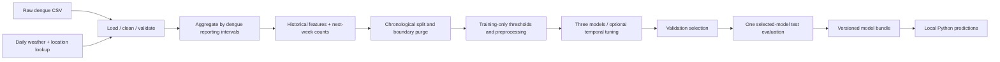

# Dengue Risk Classification

A Python 3.11 undergraduate Computer Science project that classifies **next-week
dengue outbreak risk** for Sri Lankan reporting districts as **LOW, MEDIUM, HIGH**,
using historical weekly cases and observed weather. Models run on a CPU.

**This system is an academic risk classification system and not a medical
diagnostic system.** Risk labels are relative to training-period case quantiles;
they are not official public-health outbreak definitions or population-adjusted
incidence thresholds. Probabilities have not been clinically validated or calibrated.

## Problem and Sri Lankan context

Historical case patterns and weather can support academic study of local dengue
risk. The practical question is: after reporting week **t** ends, what risk class
is expected for **t+1**? The supplied case file has 26 reporting areas, including
Kalmunai separately from Ampara. Sri Lanka has 25 administrative districts; the
extra reporting area must not be merged by assumption.

## Objectives

- Preserve and validate real raw observations, with transparent schema/coverage errors.
- Engineer historical features without future observations or random temporal splits.
- Compare Logistic Regression, Random Forest, and XGBoost on identical periods.
- Persist complete preprocessing/model contracts and calculated evaluation reports locally.
- Load the saved model for local predictions without running a service.

## Architecture


```mermaid
flowchart LR
  A[Raw dengue CSV] --> C[Load / clean / validate]
  B[Daily weather + location lookup] --> C
  C --> D[Aggregate by dengue reporting intervals]
  D --> E[Historical features + next-week counts]
  E --> F[Chronological split and boundary purge]
  F --> G[Training-only thresholds and preprocessing]
  G --> H[Three models / optional temporal tuning]
  H --> I[Validation selection]
  I --> J[One selected-model test evaluation]
  J --> K[Versioned model bundle]
  K --> L[Local Python predictions]
```

## Dataset information and placement

Place real CSVs here; raw files are never overwritten:

```text
data/raw/dengue/sri_lanka_dengue_weekly.csv
data/raw/weather/weatherData.csv
data/raw/weather/locationData.csv
```

The supplied dengue data have 25,766 rows, with reporting starts from 2006-12-23
through 2025-12-13. Required normalized fields: `year`, `week`, `start_date`,
`end_date`, `district`, `cases`. Dots/spaces/punctuation in headers are normalized.
The weather data have 142,371 daily observations from 2010-01-01 through 2024-06-08.
Their `location_id` joins the 27-row lookup's `city_name`.

Actual measurements include mean/min/max temperature, precipitation sum, and
**daily maximum** wind speed. The weekly wind statistic is honestly named
`mean_daily_max_wind_speed`; it is not a daily mean wind measurement. Humidity is
absent, so no humidity observations or features are invented. Configure different
real schemas in `configs/data.yaml`, including normalized weather column names
and aggregations. Missing critical columns, invalid dates/numbers, conflicting
duplicates, negative cases, and low merge coverage stop execution.

**Reporting calendar:** dengue weeks mostly run Saturday–Friday. Daily weather is
assigned to each district's actual `start_date`/`end_date` interval, then grouped
using the source `year`/`week` labels. Joining ISO weather weeks directly would
misalign the files. ISO week is used only as a seasonal feature. Two 2009 reporting
transitions have 6/8-day start gaps; affected targets/lags are invalidated.

The initial merge retains all dengue rows. It matches 73.26% to some weather;
18,825 rows have seven complete observed days. Kalmunai has no weather location.
Welimada/Bandarawela are retained in cleaning reports but are not guessed to
represent districts. Incomplete-week numeric aggregates become missing; partial
rainfall sums are not reported as full totals. No backward or forward filling is
performed. Training imputers are fitted only on their training fold/period.

By default training excludes incomplete-weather forecast rows **after** building
historical features and next-week targets on the entire dengue timeline. Coverage
exclusions are logged and saved in metadata. Thus evaluation covers 25 districts
during the weather overlap, not all dengue years. Set
`training.require_complete_weather: false` only for an explicitly justified
missing-weather experiment; use its own future-period evaluation.

The supplied files have no verified original provider URLs or licensing metadata.
Record the original providers, retrieval dates, and licenses before
redistribution or operational claims. No automatic download fabricates records.
`scripts/download_data.py --url HTTPS_URL --output data/raw/.../file.csv` accepts
an explicit verified source and refuses overwriting any existing CSV.

## Repository structure

```text
configs/                 Data and model YAML
data/raw/{dengue,weather} Real immutable inputs
data/{interim,processed}  Generated cleaned and merged tables
notebooks/               Data exploration, cleaning, and feature analysis
src/data/                Loading, cleaning, validation, interval merging, splits
src/features/            Historical features and frozen-quantile target labels
src/models/              Training, evaluation, temporal tuning, local prediction
src/utils/               Logging, configuration, JSON persistence, errors
pipelines/               Local data and training workflows
models/                  Saved bundle, thresholds, schema, metadata, reference
tests/                   Local data validation and training tests
reports/{figures,metrics} Calculated reports and confusion matrices
scripts/                 Command-line entrypoints
```

## Installation and virtual environment

From the repository root, install **Python 3.11**:

```powershell
py -3.11 -m venv .venv
.venv\Scripts\Activate.ps1
python -m pip install --upgrade pip
python -m pip install -r requirements.txt
```

Linux/macOS: `python3.11 -m venv .venv`, then `source .venv/bin/activate` and the
same pip commands. Configure paths and model settings in `configs/*.yaml`. Relative
data/config paths resolve against the repository root, not a particular machine.
The requirements pin the tested direct dependency versions. Use a fresh environment
for release reproduction and retain its full resolved package versions (including
transitive dependencies); every trained bundle records core dependency versions and a processed
data SHA-256. Numerical seeds are fixed, but cross-version bitwise identity is
not guaranteed. No TensorFlow/PyTorch dependency is used.

## Data pipeline and training

```bash
# Prepare and inspect only; generates reports/metrics/data_quality.json
python scripts/run_pipeline.py --data-only

# Complete preparation + training
python scripts/run_pipeline.py

# Reuse existing processed weekly.csv
python scripts/train_model.py

# Alternate configurations
python scripts/train_model.py --data-config configs/data.yaml --model-config configs/model.yaml
```

The forecast origin is the end of reporting week t. Current cases/weather at t
and district-specific case/weather lags are allowed. Rolling means include t
and previous weeks; growth relative to a zero previous count is missing. No t+1
case count, future weather, target field, date identifier, or merge indicator
enters preprocessing. `calendar_year`, month, quarter, and ISO `week_of_year`
provide calendar features while original reporting keys remain audit metadata.

The target is cases in the genuinely adjacent next week. Unobserved final targets
and calendar gaps are excluded, never filled. Train/validation/test use entire
chronological forecast weeks (70/15/15 by default), so districts in a week stay
together. Training labels crossing the validation forecast boundary and validation
labels crossing the test boundary are purged. Configurable explicit ISO
`validation_start`/`test_start` boundaries override ratios; configure both together.
All forecast/target date ranges and purge counts are logged.

Training's **next-week counts only** fit the 50th and 80th percentile thresholds:
LOW <= lower threshold; MEDIUM above lower and <= upper; HIGH above upper.
Thresholds stay frozen across validation/test and delayed-label scoring. Inference
uses the classes learned from that definition; it never recalculates quantiles.
Collapsed thresholds or a training period lacking any class fail clearly.

Numerical median imputation and categorical imputation/one-hot encoding live inside
each sklearn Pipeline. Only Logistic Regression is scaled. Logistic Regression
and Random Forest use balanced class weights; XGBoost uses balanced training
sample weights. No oversampling occurs. The **validation macro F1** selects the
model by default; only the selected model is evaluated once on the test set per
training run. Keep the held-out test period fixed and do not iterate model choices
using its reported performance. The final model remains fitted on training only
to preserve the documented threshold/preprocessing contract.

Optional tuning: set `tuning.enabled: true` in `configs/model.yaml`. Small
RandomizedSearchCV searches run within training with calendar-grouped expanding
folds, purged boundary labels, fold-specific thresholds, and fold-fitted pipelines.
This costs more CPU; it is disabled by default.

Generated `models/` outputs are `best_model.joblib` (a coherent bundle of pipeline,
schema, thresholds, and metadata), `target_thresholds.json`, `feature_schema.json`,
`model_metadata.json`, and `reference_data.csv`. Archive the whole generation
before deliberately training a replacement. joblib loads trusted local artifacts only.
Reports contain calculated accuracy, macro precision/recall/F1, weighted F1,
per-class metrics, HIGH recall, confusion matrices, and multiclass one-vs-rest AUC
where defined. No metric is hardcoded.

## Local prediction and saved results

Training is complete in the current workspace. Use `models/best_model.joblib`
for predictions and read `reports/model_report.md` for the existing results.
Running the training commands again replaces the configured model and report
outputs, so copy the current generation first if you want to keep it.

Run this Python code from the repository root to predict with the saved example:

```python
from src.models.predict import RiskPredictor
from src.utils.helpers import read_json

example = read_json("reports/prediction_example.json")
predictor = RiskPredictor("models/best_model.joblib")
result = predictor.predict(example["district"], example["features"])
print(result)
```

The predictor requires the exact engineered numeric fields in the saved feature
schema. Construct features from ordered observed history using `build_features`;
the predictor does not accept raw daily weather. Nullable historical fields use
the saved imputer. Current cases/calendar and required observed weather must be
valid. Unknown districts are outside the evaluated training coverage.

Training writes validation comparisons, test metrics, and confusion matrices
under `reports/`, plus the selected pipeline and metadata under `models/`.
Optional tuning results are saved to `reports/metrics/<model>_tuning.json`.
Training and prediction require no tracking server or external services.
Existing `mlflow/` and `mlruns/` directories are retained as historical experiment
records; the local workflow no longer reads or writes them.

## Local checks

```bash
pytest
ruff check .
python scripts/run_pipeline.py --help
python scripts/train_model.py --help
```

Synthetic data exist only in small tests, never as project training data.
Tests cover data cleaning, date/count validation, district aliases, weather lookup,
reporting-calendar aggregation, local training with and without tuning, and saved
model predictions. Jupyter can be installed separately for interactive analysis.

## Limitations

Availability through week t is an assumption that must be checked against actual
dengue publication delays and weather revisions. The files' provenance/licenses
remain unverified. District case quantiles are global and not adjusted for population;
performance can differ by district and year. The current default model covers the
weather overlap through June 2024, so newer forecasts need updated real weather
and fresh future-period evaluation. No medical efficacy or causality is claimed.

## Future improvements

- Verify source/retrieval/license/publication-latency records and automate authorized ingestion.
- Collect aligned weather for missing reporting areas and newer periods.
- Add population-adjusted and district-wise evaluation, rolling backtests, and calibration.
- Add a persistence baseline and explain feature contributions for the viva.

## Team contributions

Replace placeholders with the actual team; no authorship is invented.

| Member | Responsibility | Evidence |
|---|---|---|
| To fill | Data/provenance and cleaning | Commits, data quality report |
| To fill | Features/models and evaluation | Saved models and calculated metrics |
| To fill | Local prediction and testing | Prediction example and test results |
| To fill | Analysis/documentation | Notebooks, model report, viva notes |
